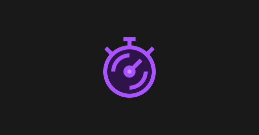

# Stopwatch

A minimalistic and functional online stopwatch with lap time recording and an animated display. Perfect for timing events, workouts, and more. 



## Table of Contents

- [Features](#features)
- [Usage](#usage)
- [Project Structure](#project-structure)
- [Technologies Used](#technologies-used)
- [Reporting Issues](#reporting-issues)
- [License](#license)

## Features

- **Start, Stop, Reset:** Control the stopwatch with intuitive buttons.
- **Lap Times:** Record multiple lap times.
- **Animated Display:** Visual feedback with animation effects.

## Usage

1. Simply open this link.
2. Click the start button to start timing.
3. Click the lap button to record lap times.
4. Click the stop button to stop the timer.
5. Click the reset button to reset the stopwatch.

*Ensure you have installed web browser (Chrome, Firefox, etc.) in your device.

## Project Structure

```plaintext
stopwatch/
├── src/                  # Source files
│   ├── index.html        # Main HTML file
│   ├── style.css         # CSS styles
│   └── script.js         # JavaScript functionality
├── assets/               # Asset files
│   ├── favicon.png       # Favicon
│   └── preview.png       # Preview image
├── README.md             # Project documentation
└── LICENSE               # License File
```

## Technologies Used

- HTML
- CSS
- JavaScript

## Reporting Issues

If you encounter any functional issue, screen adjustment issue, or complaint about the design, please let me know in the 'Issues' section. I will make every effort to fix it as quickly as possible.

## License

This project is licensed under the terms of the private license. No permission is granted to use, copy, or distribute the code.

@ Designed and developed by Atia Farha | ALL RIGHTS RESERVED